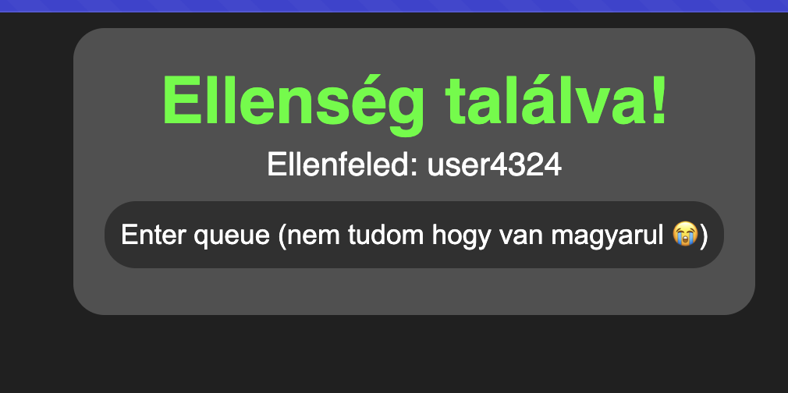

# Queue/Matchmaking concept

Egy queue rendszer ami szint és erősség alapján rak össze playereket.

> [!NOTE]  
> Mivel én inkább a backend felé hajlok, és mivel csak kicsit ismerem a reactot, a frontend kódja ~ 50% AI.

## Hogy működik?
Playerek tudnak csatlakozni a queuehoz. Ha megvan >=4 player, akkor párosával szétválogatja szint és kombinált erő (fegyver ereje + karakter ereje) alapján a playereket hogy tudjanak harcolni.
(Azért 4 player, hogy skill based legyen. Ezt lehet tweakelni addig ameddig ez a mérték nem perfect.)

Ha páratlan player keres játékot, az utolsó páratlan ember így a queue elejére kerül és keres tovább.

## Kipróbálás
0. Klónozd le a repo-t és menj be a mappába.

### Frontend
1. Menj be a frontend mappába és telepíts mindent
```sh
cd frontend
bun i # vagy másik tetszőleges runtime
```

2. Futtasd a vite-et
```sh
bun run vite # szintúgy, kb bármelyik runtime
```

### Backend
1. Menj be a backend mappába és telepíts mindent
```sh
cd backend
bun i # vagy másik tetszőleges runtime
```

2. Futtasd simán az entry fájlt
```sh
bun . # szintúgy, kb bármelyik runtime
```

## Egyebek
- Tudom, egy switch-case jobb lett volna a sok if helyére.
- Nincsenek a JSON fieldek checkolva.
- Tudom hogy nagy valszeg a player összerakást egy gyorsabb és/vagy memory efficientebb módon meg lehetett volna csinálni.
- Igen, a frontend adja át a player szintet a szervernek, de szerintem ezt is könnyen meg lehet oldani, és random számokat generál tesztből